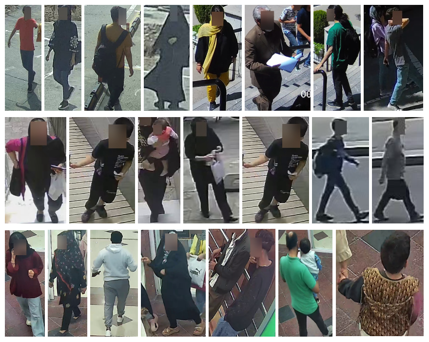
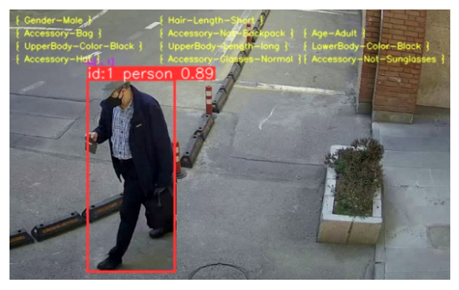

# IslamicPAR

<p align="center">
  
</p>

<p align="center">
  <em>sample boxes from IslamicPAR</em>
</p>

## Project Overview
This project focuses on Pedestrian Attribute Recognition (PAR), an important yet challenging task that plays a key role in Pedestrian Re-Identification (ReID) and Person Retrieval. We present a novel real-world dataset named **IslamicPAR** suited to the PAR task and enriched in diverse environments and cultural contexts. We also fine-tune the C2T-Net model with some improvements to the dataset.

### 🔍 Key features of the dataset
1. **Cultural Adaptation**: Our dataset is specifically designed to reflect Islamic cultural norms, providing a unique contribution to the PAR community. This dataset includes a wide variety of clothing styles, such as Hijab models, and formal and informal wear for male and female pedestrians.
2. **Environmental & Scene Diversity**: To support robust model generalization, the dataset includes:
    - A range of illumination conditions (day/night, varying shadows)
    - Weather variations, including rainy conditions
    - Realistic challenges such as:
      - Occluded pedestrians
      - Multiple people per box
      - Partial body visibility

### 📊 Data Statistics
In the following table, information about the extracted boxes is reported.

Location             | # of Cameras | # of Boxes | Box Resolution(avg)
---------------------|--------------|------------|----------------
Sharif University    | 2            | 1,124      |    311x678
Local Shop Center    | 1            |   70       |    158x329
Local Hospital       | 1            |   591      |    145x280
Total                | 4            | 1,785      | 208x442 (all boxes)

### ⬇️ Download Dataset

You can download the full dataset from Google Drive:

🔗 [Download islamicPAR.zip](https://drive.google.com/your-download-link-here)

After extracting `islamicPAR.zip`, you should see the following structure:

```
islamicPAR/
├── release_data/
│   ├── c1_v1_1_192.jpg
│   ├── c2_v3_23_37.jpg
│   └── ...
└── dataset.xlsx
```

- **`release_data/`**: Contains all pedestrian image boxes (cropped from video).
- **`dataset.xlsx`**: Contains annotations for each image, including gender, clothing, accessories, and cultural attire.
  
❗ Note: To ensure ethical use and privacy, all faces have been blurred.

---

### 🖼️ Image (Box) Description

The dataset contains 1,785 cropped pedestrian images (referred to as boxes), located in the release_data/ folder. Each box is extracted from a selected frame within a pedestrian trajectory (tube) captured in surveillance videos.

#### 📄 File Naming Format:

Each image filename follows the format:

```
cx_vx_number1_number2.jpg
```

Where:

- **`cx`** — Camera index (e.g., `c1`, `c2`, etc.)
- **`vx`** — Video sequence index recorded by the corresponding camera.
- **`number1`** — Tube index, identifying a unique pedestrian track within the video.
- **`number2`** — Selected frame index from that pedestrian tube.

#### 📌 Example:

```
c2_v7_128_1217.jpg
```

This filename indicates:
- **Camera 2** (`c2`)
- **Video 7** recorded by Camera 2 (`v7`)
- **Tube 128**, representing one pedestrian's trajectory
- **Frame 1217** selected from Tube 128

### 🧾 Label Description

The uploaded `dataset.xlsx` file provides annotations for each pedestrian image (box). This is a **multi-label binary classification** task, meaning each image may have multiple labels that are either true (1) or false (0).

#### 📁 Column Descriptions:

- **`ID`**: A unique identifier for each pedestrian image (box), corresponding to a file name in the dataset.

- **Binary Attribute Labels**:
  - **`U_color`**: Color of the **upper-body clothing** (e.g., `U_black`, `U_blue`, `U_brown`, ...).
  - **`L_color`**: Color of the **lower-body clothing** (e.g., `L_black`, `L_blue`, `L_brown`, ...).
  - **`Age_...`**: Attributes related to **age categories**.
  - **`Gender_female`**: Indicates whether the person is **female**.
  - **`Hair_...`**: Describes the **hair length** (for men).
  - **`Upper_short`**: Indicates whether the **sleeves are short** on the upper body (for men).
  - **Accessories**:
    - **`Backpack`**
    - **`Bag`**
    - **`Hat`**
  - **`Jeans`**: Indicates whether the lower-body clothing is **jeans**.
  - **Cloth Attributes** (for women):
    - **`Chador`**
    - **`Manto`**
    - **`Shawl`**
    - **`Maghnae`**
    - **`Roosari`**
  - **Clothing Style**:
    - **`Plaid`**
    - **`Stripped`**

- **`quality`**: A **metadata field**, not an attribute, indicating the **resolution quality** of the corresponding image (box).

> Note: `////U_Others////` and `////L_Others////` denote cases where the clothing color is not among the predefined categories or the body part is not visible.


### 🧠 Selection Strategy

To ensure both **diversity** and **balance** in the dataset, each pedestrian "tube" (i.e., a sequence of image boxes for a person) goes through a strategic selection process:

- Three candidate boxes are extracted per tube:
  1. One with the **highest resolution**
  2. One with the **median resolution**
  3. One with the **lowest resolution**

- One of these candidates is selected based on:
  - Dataset **generalization** objectives (e.g., including occluded or variably illuminated images).
  - Dataset **balance** considerations (e.g., incorporating both high- and low-resolution examples).

This strategy enables the model to learn more **robust** and **generalizable** features under a variety of visual conditions.

## 🚀 Model Development

This part of the project covers the adaptation and enhancement of **Channel-Aware Cross-Fused Transformer-style Networks (C2T-Net)** on the IslamicPAR dataset.  
C2T-Net achieved **1st place** in the [UPAR@WACV2024](https://chalearnlap.cvc.uab.cat/dataset/45/description/) challenge (January 2024) on the original UPAR dataset.

We fine-tuned the C2T-Net on our dataset and applied strategies to enhance the performance of the main model:

### 🎯 Fine-Tuning Strategies

We evaluated three levels of fine-tuning for the base C2T-Net:

- **Full Fine-Tuning**: All model parameters are updated.
- **Partial Fine-Tuning**: Only the cross-fusion layers are updated.
- **Head Fine-Tuning**: Only the fully connected (FC) classification head is updated.

---

### 🔧 Model Enhancement Techniques

1. **Categorical Loss**  
   Introduces category-level supervision to better capture attribute group dependencies.

2. **Sample Weighting**  
   Adjusts loss contributions based on the imbalance of positive and negative label distributions.

3. **Logit Updating**  
   Refines predicted logits using recall information from positive and negative labels.

4. **GradNorm**  
   Learns separate weights for each attribute in addition to learning the base model weights.

5. **Focal Loss**  
   Reweights the loss to focus learning on harder, less frequent samples.

> More details of the improvement methods will be added to the paper.

### 📊 Performance Comparison

| Type of Improvement           | Mean Attr Acc | Mean Acc        | Mean Positive Recall | Mean Negative Recall | F1 Score |
|------------------------------|----------------|------------------|----------------------|----------------------|----------|
| Full Fine-Tuning             | 96.60          | 83.61            | 70.64                | 96.59                | 66.22    |
| Categorical Loss             | 95.58          | 79.57            | 62.87                | 96.18                | 59.85    |
| Sample Weight                | 96.19          | 83.84            | 70.82                | 96.94                | 65.18    |
| Sample Weight + Logit Update | 96.11          | **<ins>84.98</ins>** | **<ins>73.36</ins>** | 96.63                | 65.52    |
| GradNorm                     | 96.50          | 83.44            | 68.50                | 96.41                | 65.93    |
| Focal Loss                   | 96.44          | 83.47            | 70.02                | 96.92                | 65.40    |


<sub>🔹 *Note: The reported figures correspond to the epoch with the lowest validation loss observed during training. Also we used the first version of the dataset for training process. More information will be provided in the paper*</sub>

### 🚀 Model Inference

For inference, we use the **best-performing model**, which combines the base **C2T-Net** with enhancements including **Sample Weighting** and **Logit Update** strategies. These improvements significantly boost attribute prediction accuracy and balance across classes.

The following figure demonstrates the model's inference results on a sample pedestrian box from the dataset:

<p align="center">
  
</p>

<p align="center">
  <em>Predicted attributes for a sample pedestrian image using the enhanced C2T-Net model.</em>
</p>

### 📚 Citation
If you use the IslamicPAR dataset in any publication, research, or public release, you must include the following citation:

    @misc{IslamicPAR2025,
      title={IslamicPAR: A Culturally Enriched Dataset for Pedestrian Attribute Recognition},
      author={Ali Shahedi, Ali Jokar, Hoda Mohammadzadeh},
      note={Dataset available at https://github.com/SharifDeepLab/IslamicPAR, related paper forthcoming},
      year={2025}
    }

### 🛡️ License

This dataset is released under a **Research-Only License**.  
It may be used strictly for **non-commercial research and academic purposes**.

For any other use cases, including commercial or redistribution requests, please contact the authors.

See the [LICENSE](./LICENSE) file for full terms.

### 📬 Contact

For questions, feedback, or collaboration opportunities related to the IslamicPAR dataset, please contact:

**Sharif Deep Learning Lab**

✉️ sharif.deeplab@gmail.com